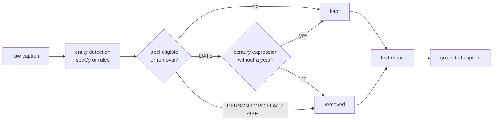

# Chapter 1 — Problem formulation: what a caption model can learn

Before choosing an architecture it is worth asking a question that is easy to skip: given this input, what is the target actually a function of? For image captioning on a corpus of described photographs the answer is uncomfortable, and confronting it early determines almost every design decision in the chapters that follow.

## 1.1 The task

We are given pairs $(x, y)$ where $x$ is an image and $y$ a sentence, and we fit a model of the conditional distribution

$$p_\theta(y \mid x) = \prod_{t=1}^{T} p_\theta(y_t \mid y_{<t}, x).$$

Training maximises the log-likelihood of the reference captions. This is a well-posed objective *provided* the reference captions are, in fact, a function of the image. The next section shows that they are not.

## 1.2 The anatomy of a reference caption

Consider a real caption from the corpus this tutorial was written against:

> Built in the 17th century by Mughal Emperor Shah Jahan as a mausoleum for his beloved wife, Mumtaz Mahal. It is a masterpiece of white marble architecture.

Decompose it by what supports each claim:

| Fragment | Supported by | Recoverable from pixels? |
|----------|--------------|--------------------------|
| *white marble* | material appearance | yes |
| *a mausoleum* | building type, form, setting | largely |
| *masterpiece of ... architecture* | evaluative, conventional | as a register, yes |
| *Built in the 17th century* | style, ornament, construction technique | weakly, and only coarsely |
| *by Mughal Emperor Shah Jahan* | the identity of the building | **no** |
| *for his beloved wife, Mumtaz Mahal* | the identity of the building | **no** |

The last two rows are the problem. Nothing in the image distinguishes a mausoleum commissioned by one person from an architecturally identical one commissioned by another. That information reaches the caption through a channel the model does not have: the annotator knew which building it was.


## 1.3 Why the model cannot learn it — and what it does instead

There is one route by which a model could produce *Shah Jahan* correctly:
recognise the specific building, and memorise the mapping from that identity to that text. This route requires the same subject to appear in training under the same caption often enough to be memorised.

In this corpus **captions are unique per image** (CORRECT ME IF IM WRONG!) . There is no repeated identity-to-text mapping to memorise, and consequently the route is closed. The same fact disqualifies the `name` column as a training target: with roughly one example per value, a classifier over `name` has nothing to generalise from. We therefore read `name` for bookkeeping and never optimise against it.

What the model learns instead is worth stating plainly, because it is the failure everyone encounters and few anticipate. Cross-entropy rewards assigning probability mass to the reference token. The model cannot know *which* proper noun follows *built by*, but it can learn with great confidence *that* a proper noun follows *built by*, and which proper nouns are frequent in the corpus. At inference time it therefore emits a fluent, grammatical, entirely fabricated attribution. The output is not obviously wrong — that is precisely what makes
it dangerous.

Two conclusions follow:

1. The declared goal of the system must be a **plausible, stylistically coherent description**, not an identification. A system evaluated against the wrong goal will be judged a failure at something it was never able to do.
2. The unlearnable content should be removed from the training targets rather than left in them. It contributes no learnable signal and it actively teaches the model to fabricate.

> Here I tried to make things as general as possible. My goal is to help you understand things, then you can see how to actually apply them with the real dataset you have.

## 1.4 Grounded captions

We therefore derive a second version of each caption, the *grounded* caption, and train against it. The raw caption is retained — it is what a human wrote, and evaluation and error analysis both need it.



Implementation: [`src/captioning/data/entities.py`](../src/captioning/data/entities.py).

### Which labels are removed

Personal names, organisations, facility names, place names and works are removed. Nationality and group adjectives (spaCy's `NORP`: *Mughal*, *French*) are **kept**, because in this domain they function as style descriptors and a style is visible. Both choices are configurable and both are arguable in the opposite direction; the point is that the choice should be made deliberately and recorded, not inherited from a default.

### Dates get their own policy

Dates are the one category that is partly grounded, and treating them uniformly loses either too much or too little.

- *1754*, *80 AD* — an exact year is not inferable from an image. Removed.
- *17th century*, *late 19th century* — a coarse period claim, supported by style, ornament and construction technique. **Kept**, because this is precisely what we are asking the model to learn.

The default policy `keep_centuries` implements exactly this distinction: a date survives if it matches a century expression and contains no explicit year.

### Three removal strategies

| Strategy | Result on the example | Trade-off |
|----------|----------------------|-----------|
| `remove` *(default)* | "Built in the 17th century as a mausoleum for his beloved wife. It is a masterpiece of white marble architecture." | Needs text repair; occasionally leaves an awkward phrase |
| `placeholder` | "Built in the 17th century by `<person>` as a mausoleum ..." | Stays grammatical; introduces artificial tokens the model will emit |
| `drop_clause` | "It is a masterpiece of white marble architecture." | Cleanest prose; discards grounded content along with the rest |

`remove` is the default because it preserves the most learnable content. It requires repairing the surrounding text — deleting a span leaves doubled function words (*built in in the late style*) and prepositions governing nothing (*for ,*) — which the module handles with targeted substitutions.

### Read the report

`scripts/prepare_captions.py --report` prints what was removed, by label and by
surface form, with examples. Two failure modes are worth looking for:

- **Under-removal.** Names the detector missed. With the rule-based fallback,   sentence-initial names are systematically missed, and any style vocabulary absent from the allowlist is treated as a name.
- **Over-removal.** Grounded content deleted by mistake. If the report shows   style terms among the most frequently removed surface forms, extend the allowlist or switch to the statistical detector.

The fallback detector exists so that the tutorial runs without optional dependencies. It is a heuristic, its failures are visible in the report, and comparing it against spaCy on your own corpus is the first exercise below.

## 1.5 A second-order consequence: the vocabulary

Proper names are not only unlearnable, they are also the principal driver of vocabulary size. Each appears once or twice; each occupies an entry in a word-level vocabulary; and at test time the unseen ones become `<unk>`.

This gives the vocabulary decision an empirical basis rather than a conventional one. Fit both schemes and measure:

```bash
python scripts/build_tokenizer.py --config configs/stage1_scratch.yaml --compare
```

The table reports vocabulary size, sequence length and out-of-vocabulary rate on the training and validation splits. A word-level vocabulary is legible (every identifier is a word) and lossy. Byte-pair encoding is lossless by construction, at the cost of longer sequences and units that no longer correspond to anything a human names. Run the comparison on the raw captions and on the grounded ones, and note how much of the word-level out-of-vocabulary rate the grounding step has already removed.

## 1.6 Metadata as auxiliary supervision

Two further columns can supervise the model, and they differ in kind.

**`century` is ordinal, not categorical.** The 16th century is adjacent to the 17th and remote from the 12th. Treating it as an unordered class discards that structure and makes every error equally costly; the appropriate losses and the appropriate error measure (mean absolute error in centuries, not accuracy) are introduced in Stage 2.

**`typology` has to be derived.** A classification target needs many examples
per class, which rules out `name` and admits a coarse type — *mausoleum*, *castle*, *amphitheatre*, *country house* — extracted from the captions.

Both are implemented as **optional heads, disabled by default**. Before enabling either, verify that your corpus supports it:

- Is `century` populated for a substantial fraction of rows? `CaptionDataset.century_coverage()` answers this. An auxiliary loss computed over a handful of labelled rows contributes noise, not supervision.
- Is the corpus homogeneous enough for a period to be a visual property at all?
  The premise "style correlates with epoch" holds for architecture. It holds
  differently, or not at all, for other subject matter.

Stage 2 opens with this check. If your corpus fails it, the correct action is to leave the heads off, not to enable them and hope.

## 1.7 What we will measure, and why the usual metric is not enough

The evaluation suite is built in its own chapter, but its shape follows from this one.

Because references are **singleton** (one caption per image, but check for real data!) the standard n-gram metrics are weaker here than their usual reputation suggests. CIDEr in particular assumes multiple references per image and its corpus statistics degrade without them. BLEU remains computable and remains reported, but a caption can score well on BLEU and be wrong, and a correct caption phrased differently from the reference scores badly.

The suite therefore reports, alongside the n-gram metrics:

- **CLIPScore**, a reference-free measure of image–text agreement, which answers "does this caption describe *this* image" rather than "does it match *this* sentence";
- **mean absolute error in centuries**, when the period head is enabled;
- **a named-entity rate** on generated captions: how often the model emits a   proper noun it cannot possibly know. After grounding, this number should be near zero, and a rise in it is the clearest early symptom that something in the pipeline has regressed.


## Try to do...

1. Run `prepare_captions.py` twice, once with `--detector rules` and once with`--detector spacy`, on the same split. Diff the two reports. Which surface forms does each detector miss, and what does that tell you about deploying the fallback?
2. Run it with `--date-policy mask_all` and `--strategy placeholder`. Inspect ten grounded captions from each. Which policy would you defend, and against what argument?
3. Run `build_tokenizer.py --compare` on `caption_raw` and on `caption_grounded` (`--caption-field`). Report the four out-of-vocabulary rates. How much of the word-level vocabulary problem was a proper-noun problem?
4. Take ten grounded captions and try to answer, for each fragment, the question in the table of §1.2. Where you disagree with the pipeline's decision, change the label set in the configuration and justify it.

---

Next: **Stage 1 — a decoder trained from scratch**.
