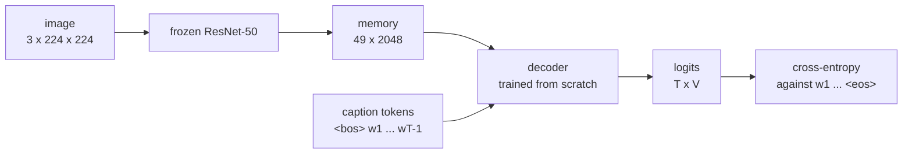

# Chapter 2 — Stage 1: a decoder trained from scratch

Chapter 1 established what the model is being asked to learn. This chapter builds the first system that learns it: a pre-trained visual encoder, frozen, feeding a caption decoder trained from nothing. Every mechanism is implemented in plain PyTorch and is meant to be read.

By the end you will have trained two decoders, generated captions with three search strategies, looked at what the model attends to, and produced the first row of the results table that Stages 2 and 3 are compared against.

## 2.1 The architecture



The encoder emits a **sequence** of feature vectors, not one pooled vector. That choice is what makes attention possible: the decoder can read different regions at different time steps rather than compressing the whole image into a single point before it says anything. A 224-pixel input through a ResNet gives a 7×7 grid — 49 memory slots, small enough to visualise.

Implementation: [`models/encoders.py`](../src/captioning/models/encoders.py),
[`models/decoders.py`](../src/captioning/models/decoders.py),
[`models/captioner.py`](../src/captioning/models/captioner.py).

## 2.2 Why the encoder is frozen

The backbone was pre-trained on far more images than this corpus contains. The decoder starts from random weights. In the first hundred steps the decoder's gradients are large and essentially meaningless, and back-propagating them into the encoder destroys the representations the encoder was chosen for — long before the decoder produces any signal worth propagating.

So Stage 1 trains the decoder only. This makes the stage fast, makes it stable, and gives Stage 2 something to improve on. Unfreezing is not skipped, it is *sequenced*.

Freezing correctly takes slightly more than setting `requires_grad`:

```python
for parameter in encoder.parameters():
    parameter.requires_grad_(False)      # necessary, not sufficient
```

A batch-normalisation layer in training mode keeps updating its running mean and variance whether or not gradients flow. A "frozen" ResNet left in `train()` therefore produces different features in epoch ten than in epoch one, silently. `VisualEncoder.train()` overrides this and keeps frozen submodules in evaluation mode. Verify it on your own model — the test is three lines:

```python
model.train()
assert all(not m.training for m in model.encoder.modules()
           if isinstance(m, torch.nn.BatchNorm2d))
```

## 2.3 Teacher forcing, and the shift that everyone gets wrong once

The decoder is trained to predict the next token given the reference prefix.
The reference `<bos> a marble mausoleum <eos>` therefore produces two aligned sequences:

| position | 0 | 1 | 2 | 3 |
|----------|---|---|---|---|
| decoder input | `<bos>` | `a` | `marble` | `mausoleum` |
| target | `a` | `marble` | `mausoleum` | `<eos>` |

Both have length `T - 1`. Omitting the shift trains the model to copy its own input, which produces a training loss near zero and a model that generates nothing. The shift is done once, in
[`data/collate.py`](../src/captioning/data/collate.py), rather than in each decoder.

Padded positions carry `IGNORE_INDEX` in the target and are excluded from the loss. Averaging over them instead makes the reported loss depend on the batch's length distribution rather than on the model.

Two conventions to keep straight:

- **`True` means forbidden.** In both `padding_mask` and the causal mask, `True` marks a position that must not be attended to — the convention of `nn.MultiheadAttention`. Inverting either produces a model that attends only to padding.
- **Truncation preserves the terminator.** `tokenizer.encode(..., max_length=n)` reserves room for `<bos>` and `<eos>`. A decoder trained on sequences that sometimes lack a terminator learns not to stop.

## 2.4 The two decoders

Train both. The comparison is the point of this stage, not a detour.

### Attentional LSTM — *Show, Attend and Tell* (2015)

State is carried forward one token at a time. At each step, additive attention scores every memory slot against the current hidden state and returns a weighted average:

$$e_i = w^\top \tanh(W_m m_i + W_q h_{t-1}), \qquad \alpha = \mathrm{softmax}(e), \qquad c_t = \sum_i \alpha_i m_i$$

A learned gate then decides how much of that visual context to admit:
`context * sigmoid(W h)`. Function words need almost none; content words need a great deal. Watching this gate over a generated caption is one of the more revealing diagnostics available at this stage.

The recurrence is written as an explicit loop over `LSTMCell`. It is slower than the fused `nn.LSTM`, and it is legible, which at this point matters more.

### Transformer decoder

Masked self-attention over the caption, cross-attention over the image grid, position-wise feed-forward, pre-norm residuals.

It is built from `nn.MultiheadAttention` rather than `nn.TransformerDecoder` for two reasons. The residual and normalisation structure stays visible. And the cross-attention weights remain reachable — `nn.TransformerDecoder` does not return them, which would make §2.7 impossible.

Two implementation notes, both deliberate:

- Embeddings are scaled by $\sqrt{d_{\text{model}}}$ before the positional   embedding is added. Without it, position dominates content early in training.
- Generation re-encodes the entire prefix at every step, making it quadratic. Caching the keys and values of past positions would make it linear. That cache is an optimisation, and this implementation is meant to be read; adding it is one of the exercises.

### What to compare

| | LSTM | Transformer |
|---|---|---|
| Parameters at equal width | more | fewer |
| Steps to converge | fewer | more |
| Benefit from more data | flattens early | keeps improving |
| Attention maps | one per step, sharp | one per step per head, diffuse |

On a small corpus the LSTM often wins. That is a real result about your data, not a failure of the Transformer, and reporting it honestly is part of the exercise.

## 2.5 The objective and the schedule

**Label smoothing** matters more here than in classification. The reference caption is one of many acceptable descriptions, so a target distribution placing all its mass on that one sentence asserts something false. Smoothing at 0.1 relaxes it.

But the smoothed value is not a log-likelihood, and exponentiating it does not give perplexity. [`training/losses.py`](../src/captioning/training/losses.py) therefore returns both: the smoothed loss to optimise and the true cross-entropy to report. Report the second.

**Warmup** is not optional for a decoder trained from scratch. In the first steps the embeddings are random and the gradients are large and badly conditioned; a full-size step moves the parameters somewhere they do not recover from. Five hundred steps of linear ramp costs nothing and removes an entire class of failed runs. Cosine decay afterwards is a default, not a
discovery.

## 2.6 Running it

```bash
# Transformer decoder (the configuration default)
python scripts/train_stage1.py --config configs/stage1_scratch.yaml

# Recurrent decoder, into its own directory so both survive
python scripts/train_stage1.py --config configs/stage1_scratch.yaml \
    --decoder lstm --output-dir runs/stage1_lstm
```

Before committing a GPU, check the wiring end to end:

```bash
python scripts/train_stage1.py --config configs/stage1_scratch.yaml \
    --epochs 1 --limit-batches 2
```

A second check is worth more than it costs: **overfit a handful of examples on purpose.** Point `train_csv` and `val_csv` at the same twenty rows, disable augmentation and dropout, and train until the loss approaches zero. If a model cannot memorise twenty captions, no amount of data will help it — the bug is in the pipeline, not in the corpus. If it can, the loop is sound.

## 2.7 Reading the attention maps

```bash
python scripts/predict.py --config configs/stage1_scratch.yaml \
    --checkpoint runs/stage1/best.pt \
    --images data/img --attention-dir runs/stage1/attention
```

Each figure shows the input followed by one panel per generated token, with the cross-attention for that step overlaid.

What to look for: does the model attend to the dome while emitting *dome*, to the facade while emitting *marble*? A model that attends to the sky while emitting content words has learned the corpus prior rather than the image, and no aggregate metric shows that as directly as the picture does.

Three cautions belong with every such figure. Attention is a soft read, not a justification — it says where the model looked, not why it decided. The grid is 7×7 and the display is upsampled, which makes the maps look smoother and more confident than they are. And each map is normalised to its own range, so panels are comparable in *where*, never in *how much*.

Figures are produced from greedy decoding even when the reported captions come from a beam, because a beam has no single trajectory to attribute attention to.

## 2.8 Generating and scoring

```bash
python scripts/evaluate.py --config configs/stage1_scratch.yaml \
    --checkpoint runs/stage1/best.pt --split val --name stage1-transformer
```

This is the evaluation that matters. Validation loss measures next-token prediction *given the reference prefix*; generation makes the model produce its own prefixes, which is the regime it will be used in. The gap between the two (*exposure bias*) is why validation loss can improve while captions get worse.

### Choosing a decoding strategy

| Strategy | Use it when |
|----------|-------------|
| `greedy` | Debugging, attention figures, or a speed floor |
| `beam` | Reporting metrics. Requires length normalisation |
| `nucleus` | Diversity is the goal. Not for reference-similarity metrics |

Beam search without length normalisation almost always returns the shortest hypothesis, because each additional token multiplies in a probability below one. The implementation divides by `length ** length_penalty`; at 0 the penalty is off and the bias is plainly visible. Try both and look at the mean caption length in the table.

### Reading the table

```
system                  CE↓     PPL↓  BLEU-4↑  ROUGE-L↑  dist-2↑      len  halluc.↓  century↑
---------------------------------------------------------------------------------------------
stage1-transformer    2.310    10.10    0.086     0.271    0.412     18.4     0.020     0.430
```

Read it in this order.

1. **`dist-2` first.** If it is near zero the model has collapsed onto one generic caption, and every other column is describing that one sentence.  This is the characteristic failure of a captioner trained on too little data, and BLEU reports it as merely unremarkable rather than as broken.
2. **`halluc.` second.** After grounding, the rate of named entities in generated captions should be close to zero. A high value means the model is fabricating attributions, which almost always means it was trained on `caption_raw` — check which column `CaptionDataset` logged at startup.
3. **`BLEU-4` and `ROUGE-L` third, and with suspicion.** References here are singleton (§1.7). Use them to compare systems evaluated identically, not as absolute quality.
4. **`century` last, as the one factual claim the model can be right about.** In Stage 1 it is unsupervised — whatever the decoder picked up from the text alone. Stage 2 supervises it directly, and the change in this column is how you will know whether that helped.

Add reference-free grounding when the dependency is available:

```bash
python scripts/evaluate.py --config configs/stage1_scratch.yaml \
    --checkpoint runs/stage1/best.pt --clip \
    --compare runs/stage1_lstm/metrics.json
```

Every run writes `metrics.json` next to its checkpoint, and `--compare` prints earlier rows alongside the current one. Use it. Three stages measured at three slightly different moments with three slightly different decoding settings are not a comparison.

## 2.9 When it goes wrong

| Symptom | Likely cause |
|---------|--------------|
| Training loss near zero, generation is nonsense | The teacher-forcing shift is missing; the model is copying its input |
| Loss stuck at `log(vocab_size)` | Learning rate too high, or warmup missing; the decoder never left its initialisation |
| Every image gets the same caption | Too little data, or the encoder output is effectively constant — check that the transform normalisation matches the backbone |
| Captions never terminate | `<eos>` truncated away; raise `max_caption_length` |
| Beam output shorter than greedy | Length penalty at 0 |
| Generated captions full of names | Trained on `caption_raw`; see §1.4 |
| Validation loss improves, captions worsen | Exposure bias — expected, and the reason §2.8 exists |
| Frozen encoder, yet features drift between epochs | Batch-norm left in training mode (§2.2) |

## TTry to do...
1. Train both decoders with matched parameter budgets and report both rows of the table. Which wins on your corpus, and does the ranking change between teacher-forced cross-entropy and generated BLEU? Explain any disagreement.
2. Evaluate the same checkpoint with `--strategy greedy` and `--strategy beam`, then with `--length-penalty 0`. Tabulate mean caption length against BLEU-4. What is the penalty actually buying?
3. Overfit twenty examples deliberately, as in §2.6. Record how many epochs it takes each decoder to reach a perplexity below 1.5.
4. Add key–value caching to `TransformerCaptionDecoder.step`. Verify that the generated captions are unchanged and measure the speedup as a function of caption length.
5. Take five images where the model is confidently wrong and inspect their attention figures. Is it attending to the wrong region, or to the right one and describing it wrongly? The two failures call for different fixes.

---

Next: **Stage 2 — auxiliary supervision and progressive unfreezing**.
